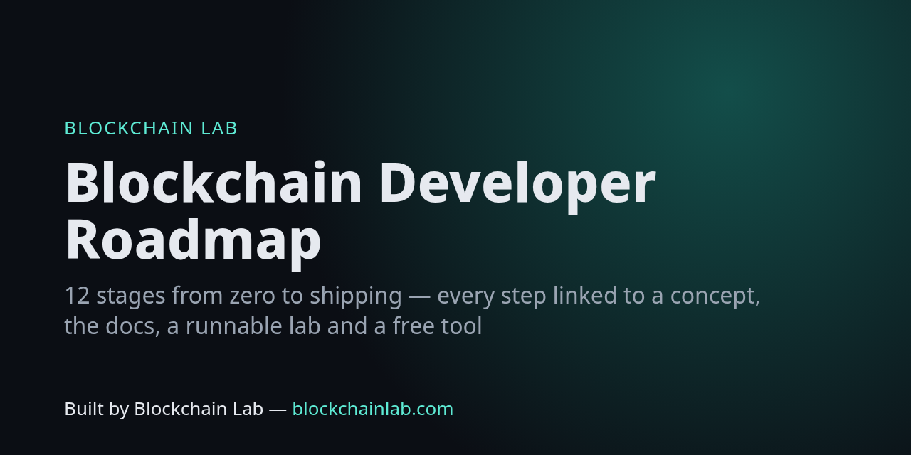

# Blockchain Developer Roadmap (2026)



**A curated, opinionated path from zero to shipping production smart contracts.** Every stage links to a concept explainer on Blockchain Lab, the primary docs, a hands-on lab you can run, and a free tool to check your work.

> Built by **Blockchain Lab — [blockchainlab.com](https://blockchainlab.com/?utm_source=github&utm_medium=readme&utm_campaign=blockchain-dev-roadmap)** · All links are checked weekly in CI.

```
Stage 0  Foundations ──► 1 Ethereum & the EVM ──► 2 Solidity ──► 3 Testing & tooling
   ──► 4 Token standards ──► 5 DeFi primitives ──► 6 Security ──► 7 Upgrades & storage
   ──► 8 Scaling (L2s) ──► 9 Frontend & indexing ──► 10 Other ecosystems ──► 11 Zero knowledge ──► 12 Ship
```

## Stage 0 — Foundations (1–2 weeks)

Learn what a blockchain does and what it doesn't do before you write code.

- Concepts: [hash](https://blockchainlab.com/learn/concepts/hash?utm_source=github&utm_medium=readme&utm_campaign=blockchain-dev-roadmap) · [Merkle tree](https://blockchainlab.com/learn/concepts/merkle-tree?utm_source=github&utm_medium=readme&utm_campaign=blockchain-dev-roadmap) · [public key](https://blockchainlab.com/learn/concepts/public-key?utm_source=github&utm_medium=readme&utm_campaign=blockchain-dev-roadmap) / [private key](https://blockchainlab.com/learn/concepts/private-key?utm_source=github&utm_medium=readme&utm_campaign=blockchain-dev-roadmap) · [consensus](https://blockchainlab.com/learn/concepts/consensus?utm_source=github&utm_medium=readme&utm_campaign=blockchain-dev-roadmap) · [proof of work](https://blockchainlab.com/learn/concepts/proof-of-work?utm_source=github&utm_medium=readme&utm_campaign=blockchain-dev-roadmap) vs [proof of stake](https://blockchainlab.com/learn/concepts/proof-of-stake?utm_source=github&utm_medium=readme&utm_campaign=blockchain-dev-roadmap) ([compare](https://blockchainlab.com/learn/compare/proof-of-stake-vs-proof-of-work?utm_source=github&utm_medium=readme&utm_campaign=blockchain-dev-roadmap)) · [finality](https://blockchainlab.com/learn/concepts/finality?utm_source=github&utm_medium=readme&utm_campaign=blockchain-dev-roadmap)
- Read the source: [Bitcoin whitepaper](https://blockchainlab.com/research/corpus/papers/bitcoin?utm_source=github&utm_medium=readme&utm_campaign=blockchain-dev-roadmap) · [Ethereum whitepaper](https://ethereum.org/en/whitepaper/) · the full [whitepaper library](https://blockchainlab.com/whitepaper?utm_source=github&utm_medium=readme&utm_campaign=blockchain-dev-roadmap) and [Blockchain canon](https://blockchainlab.com/learn/blockchain-canon?utm_source=github&utm_medium=readme&utm_campaign=blockchain-dev-roadmap)
- Fast overview: [Blockchain in 60 minutes](https://blockchainlab.com/learn/blockchain-in-60-minutes?utm_source=github&utm_medium=readme&utm_campaign=blockchain-dev-roadmap) · [Fundamentals](https://blockchainlab.com/learn/fundamentals?utm_source=github&utm_medium=readme&utm_campaign=blockchain-dev-roadmap) · [Glossary](https://blockchainlab.com/learn/glossary?utm_source=github&utm_medium=readme&utm_campaign=blockchain-dev-roadmap)
- Book: [Mastering Bitcoin](https://github.com/bitcoinbook/bitcoinbook) · [Mastering Ethereum](https://github.com/ethereumbook/ethereumbook)
- Tool: hash things yourself → [keccak / sha256 / Merkle](https://blockchains.github.io/blockchainlab-tools/hash/)

## Stage 1 — Ethereum and the EVM (1–2 weeks)

- Docs: [ethereum.org developer docs](https://ethereum.org/en/developers/docs/) · opcodes at [evm.codes](https://www.evm.codes/)
- Concepts: [smart contract](https://blockchainlab.com/learn/concepts/smart-contract?utm_source=github&utm_medium=readme&utm_campaign=blockchain-dev-roadmap) · [virtual machine](https://blockchainlab.com/learn/concepts/virtual-machine?utm_source=github&utm_medium=readme&utm_campaign=blockchain-dev-roadmap) · [wallet](https://blockchainlab.com/learn/concepts/wallet?utm_source=github&utm_medium=readme&utm_campaign=blockchain-dev-roadmap) · gas and [EIP-1559](https://eips.ethereum.org/EIPS/eip-1559)
- Tools: [gas estimator](https://blockchains.github.io/blockchainlab-tools/gas/) · [unit converter](https://blockchains.github.io/blockchainlab-tools/units/) · [tx decoder](https://blockchains.github.io/blockchainlab-tools/tx/) (decode a real mainnet tx and explain every field)
- Protocol profiles: [Ethereum](https://blockchainlab.com/learn/protocols/ethereum?utm_source=github&utm_medium=readme&utm_campaign=blockchain-dev-roadmap) · [Protocol atlas](https://blockchainlab.com/learn/protocol-atlas?utm_source=github&utm_medium=readme&utm_campaign=blockchain-dev-roadmap)

## Stage 2 — Solidity (2–4 weeks)

- Docs: [Solidity docs](https://docs.soliditylang.org/en/latest/)
- Labs: [01 storage](https://github.com/Blockchains/blockchainlab-labs/blob/main/src/L01_SimpleStorage.sol) · [02 events & errors](https://github.com/Blockchains/blockchainlab-labs/blob/main/src/L02_Counter.sol) · [03 access control](https://github.com/Blockchains/blockchainlab-labs/blob/main/src/L03_Ownable.sol) · [08 holding ETH](https://github.com/Blockchains/blockchainlab-labs/blob/main/src/L08_EtherVault.sol) · [10 arithmetic](https://github.com/Blockchains/blockchainlab-labs/blob/main/src/L10_Arithmetic.sol)
- Tool: [ABI encoder/decoder & selectors](https://blockchains.github.io/blockchainlab-tools/abi/)

## Stage 3 — Testing and tooling (ongoing)

- [Foundry](https://getfoundry.sh/) ([repo](https://github.com/foundry-rs/foundry)) — default choice in 2026 · [Hardhat](https://hardhat.org/docs) · [ethers v6](https://docs.ethers.org/v6/) · [viem](https://viem.sh/)
- Labs: [27 fuzzing](https://github.com/Blockchains/blockchainlab-labs/blob/main/test/L27_FuzzMath.t.sol) · [28 invariants](https://github.com/Blockchains/blockchainlab-labs/blob/main/test/L28_InvariantVault.t.sol) · [29 mainnet fork](https://github.com/Blockchains/blockchainlab-labs/blob/main/test/L29_MainnetFork.t.sol) · [H1 Hardhat](https://github.com/Blockchains/blockchainlab-labs/blob/main/hardhat/test/Counter.test.js)

## Stage 4 — Token standards (1–2 weeks)

- [OpenZeppelin Contracts 5.x](https://docs.openzeppelin.com/contracts/5.x/) · search every ERC in the [EIP/ERC reference](https://blockchains.github.io/blockchainlab-tools/reference/)
- Labs: [04 ERC-20 from scratch](https://github.com/Blockchains/blockchainlab-labs/blob/main/src/L04_ERC20Scratch.sol) · [05 OZ ERC-20](https://github.com/Blockchains/blockchainlab-labs/blob/main/src/L05_OZToken.sol) · [06 ERC-721](https://github.com/Blockchains/blockchainlab-labs/blob/main/src/L06_NFT.sol) · [07 ERC-1155](https://github.com/Blockchains/blockchainlab-labs/blob/main/src/L07_MultiToken.sol) · [12 permit / EIP-712](https://github.com/Blockchains/blockchainlab-labs/blob/main/src/L12_Permit.sol) ([EIP-2612](https://eips.ethereum.org/EIPS/eip-2612), [EIP-712](https://eips.ethereum.org/EIPS/eip-712)) · vaults: [ERC-4626](https://eips.ethereum.org/EIPS/eip-4626)
- Concepts: [tokenisation](https://blockchainlab.com/learn/concepts/tokenisation?utm_source=github&utm_medium=readme&utm_campaign=blockchain-dev-roadmap) · [real-world assets](https://blockchainlab.com/learn/concepts/rwa?utm_source=github&utm_medium=readme&utm_campaign=blockchain-dev-roadmap) · [stablecoins](https://blockchainlab.com/learn/concepts/stablecoin?utm_source=github&utm_medium=readme&utm_campaign=blockchain-dev-roadmap) ([algorithmic vs reserve](https://blockchainlab.com/learn/compare/algorithmic-vs-reserve-stablecoins?utm_source=github&utm_medium=readme&utm_campaign=blockchain-dev-roadmap))

## Stage 5 — DeFi primitives (2–4 weeks)

- Labs: [21 constant-product AMM](https://github.com/Blockchains/blockchainlab-labs/blob/main/src/L21_ConstantProductAMM.sol) · [22 flash loans](https://github.com/Blockchains/blockchainlab-labs/blob/main/src/L22_FlashLoan.sol) · [20 staking rewards](https://github.com/Blockchains/blockchainlab-labs/blob/main/src/L20_StakingRewards.sol) · [17](https://github.com/Blockchains/blockchainlab-labs/blob/main/src/L17_DutchAuction.sol)/[18 auctions](https://github.com/Blockchains/blockchainlab-labs/blob/main/src/L18_EnglishAuction.sol) · [11 Merkle airdrop](https://github.com/Blockchains/blockchainlab-labs/blob/main/src/L11_MerkleAirdrop.sol)
- Read real protocols: [Uniswap docs](https://docs.uniswap.org/) · [Aave developer docs](https://docs.aave.com/developers/) · [Chainlink docs](https://docs.chain.link/) ([oracles](https://blockchainlab.com/learn/concepts/oracle?utm_source=github&utm_medium=readme&utm_campaign=blockchain-dev-roadmap))
- Data: [DefiLlama](https://defillama.com/) · [Blockchain Lab Open Data API — protocols TVL](https://blockchains.github.io/blockchainlab-api/v1/protocols.json)
- Staking: [liquid staking](https://blockchainlab.com/learn/concepts/liquid-staking?utm_source=github&utm_medium=readme&utm_campaign=blockchain-dev-roadmap) · [restaking](https://blockchainlab.com/learn/concepts/restaking?utm_source=github&utm_medium=readme&utm_campaign=blockchain-dev-roadmap) · [native vs liquid vs restaking](https://blockchainlab.com/intelligence/staking/native-vs-liquid-vs-restaking?utm_source=github&utm_medium=readme&utm_campaign=blockchain-dev-roadmap)

## Stage 6 — Security (never finished)

- Labs: [09 reentrancy attack + fixes](https://github.com/Blockchains/blockchainlab-labs/blob/main/src/L09_Reentrancy.sol) · [13 signature replay](https://github.com/Blockchains/blockchainlab-labs/blob/main/src/L13_Signatures.sol) · [16 commit-reveal / front-running](https://github.com/Blockchains/blockchainlab-labs/blob/main/src/L16_CommitReveal.sol)
- Practice: [Ethernaut](https://ethernaut.openzeppelin.com/) · [Damn Vulnerable DeFi](https://www.damnvulnerabledefi.xyz/)
- Tools & knowledge: [Slither](https://github.com/crytic/slither) · [Halmos](https://github.com/a16z/halmos) · [Building Secure Contracts](https://secure-contracts.com/) · [Solodit findings](https://solodit.cyfrin.io/) · [Rekt leaderboard](https://rekt.news/leaderboard/)
- Learn from failures: [Failure atlas](https://blockchainlab.com/learn/failure-atlas?utm_source=github&utm_medium=readme&utm_campaign=blockchain-dev-roadmap) · [Smart-contract security assurance](https://blockchainlab.com/development-lab/smart-contract-security-assurance?utm_source=github&utm_medium=readme&utm_campaign=blockchain-dev-roadmap)
- MEV: [Flashbots docs](https://docs.flashbots.net/)

## Stage 7 — Upgrades and storage (1 week)

- Labs: [23 UUPS + ERC-1967](https://github.com/Blockchains/blockchainlab-labs/blob/main/src/L23_UpgradeableProxy.sol) · [24 ERC-7201 namespaces](https://github.com/Blockchains/blockchainlab-labs/blob/main/src/L24_NamespacedStorage.sol) · [25 storage layout](https://github.com/Blockchains/blockchainlab-labs/blob/main/src/L25_StorageLayout.sol) · [26 gas](https://github.com/Blockchains/blockchainlab-labs/blob/main/src/L26_GasOptimisation.sol) · [30 CREATE2](https://github.com/Blockchains/blockchainlab-labs/blob/main/src/L30_Create2Factory.sol)
- Specs: [storage layout](https://docs.soliditylang.org/en/latest/internals/layout_in_storage.html) · [EIP-1967](https://eips.ethereum.org/EIPS/eip-1967) · [ERC-7201](https://eips.ethereum.org/EIPS/eip-7201)
- Tool: [storage-slot calculator + live reads](https://blockchains.github.io/blockchainlab-tools/storage/) · [address inspector (proxy implementation)](https://blockchains.github.io/blockchainlab-tools/address/)

## Stage 8 — Scaling and L2s (1–2 weeks)

- Concepts: [rollups](https://blockchainlab.com/learn/concepts/rollup?utm_source=github&utm_medium=readme&utm_campaign=blockchain-dev-roadmap) · [data availability](https://blockchainlab.com/learn/concepts/data-availability?utm_source=github&utm_medium=readme&utm_campaign=blockchain-dev-roadmap) · [bridges](https://blockchainlab.com/learn/concepts/bridge?utm_source=github&utm_medium=readme&utm_campaign=blockchain-dev-roadmap) · [plasma vs rollups](https://blockchainlab.com/learn/compare/plasma-vs-rollups?utm_source=github&utm_medium=readme&utm_campaign=blockchain-dev-roadmap) · [Lightning vs on-chain](https://blockchainlab.com/learn/compare/lightning-vs-on-chain?utm_source=github&utm_medium=readme&utm_campaign=blockchain-dev-roadmap)
- Docs: [ethereum.org scaling](https://ethereum.org/en/developers/docs/scaling/) · [OP Stack](https://docs.optimism.io/) · [Arbitrum](https://docs.arbitrum.io/) · [Base](https://docs.base.org/) · risk dashboards on [L2BEAT](https://l2beat.com/scaling/summary)
- Account abstraction: [ERC-4337](https://eips.ethereum.org/EIPS/eip-4337) · [EIP-7702](https://eips.ethereum.org/EIPS/eip-7702)
- Tool: compare live fees across L1/L2s → [gas estimator](https://blockchains.github.io/blockchainlab-tools/gas/) · [chainlist](https://blockchains.github.io/blockchainlab-tools/chains/)

## Stage 9 — Frontend and indexing (1–2 weeks)

- [wagmi](https://wagmi.sh/) · [viem](https://viem.sh/) · [MetaMask docs](https://docs.metamask.io/) · [WalletConnect / Reown](https://docs.walletconnect.network/)
- Indexing: [The Graph](https://thegraph.com/docs/)
- Free data for your app: [Blockchain Lab Open Data API](https://blockchains.github.io/blockchainlab-api/) · let AI agents use it via [blockchainlab-mcp](https://github.com/Blockchains/blockchainlab-mcp)

## Stage 10 — Other ecosystems

- Solana: [docs](https://solana.com/docs) · [Anchor](https://www.anchor-lang.com/docs) · [profile](https://blockchainlab.com/learn/protocols/solana?utm_source=github&utm_medium=readme&utm_campaign=blockchain-dev-roadmap)
- Bitcoin: [developer docs](https://developer.bitcoin.org/) · [profile](https://blockchainlab.com/learn/protocols/bitcoin?utm_source=github&utm_medium=readme&utm_campaign=blockchain-dev-roadmap)
- Cosmos: [Cosmos SDK docs](https://docs.cosmos.network/) · [Cosmos vs Polkadot](https://blockchainlab.com/learn/compare/cosmos-vs-polkadot?utm_source=github&utm_medium=readme&utm_campaign=blockchain-dev-roadmap) · [Tendermint](https://blockchainlab.com/learn/protocols/tendermint?utm_source=github&utm_medium=readme&utm_campaign=blockchain-dev-roadmap)

## Stage 11 — Zero knowledge

- Concepts: [zero-knowledge proofs](https://blockchainlab.com/learn/concepts/zero-knowledge?utm_source=github&utm_medium=readme&utm_campaign=blockchain-dev-roadmap) · [STARK vs SNARK](https://blockchainlab.com/learn/compare/stark-vs-snark?utm_source=github&utm_medium=readme&utm_campaign=blockchain-dev-roadmap)
- Build: [Noir](https://noir-lang.org/docs/) · resources at [zkp.science](https://zkp.science/)

## Stage 12 — Ship

- Hackathons: [ETHGlobal](https://ethglobal.com/events) · [Devpost](https://devpost.com/hackathons) · the live [Blockchain Lab hackathons feed](https://blockchains.github.io/blockchainlab-api/v1/hackathons.json) and [tracker](https://github.com/Blockchains/hackathons)
- Funding: [grants directory](https://blockchains.github.io/blockchainlab-api/v1/grants.json) (22 programmes, link-checked nightly)
- Interview prep: [blockchain-interview-questions](https://github.com/Blockchains/blockchain-interview-questions)
- Ideas: [What should I build?](https://blockchainlab.com/tools/what-should-i-build?utm_source=github&utm_medium=readme&utm_campaign=blockchain-dev-roadmap) · [Constructor](https://blockchainlab.com/forge/composer?utm_source=github&utm_medium=readme&utm_campaign=blockchain-dev-roadmap)
- Guided courses: [Speedrun Ethereum](https://speedrunethereum.com/) · [CryptoZombies](https://cryptozombies.io/)

## Specialisations

| Track | Start here |
|---|---|
| Custody & wallets | [custody](https://blockchainlab.com/learn/concepts/custody?utm_source=github&utm_medium=readme&utm_campaign=blockchain-dev-roadmap) · [MPC](https://blockchainlab.com/learn/concepts/mpc?utm_source=github&utm_medium=readme&utm_campaign=blockchain-dev-roadmap) · [multisig](https://blockchainlab.com/learn/concepts/multisig?utm_source=github&utm_medium=readme&utm_campaign=blockchain-dev-roadmap) · [HSM](https://blockchainlab.com/learn/concepts/hsm?utm_source=github&utm_medium=readme&utm_campaign=blockchain-dev-roadmap) · [MPC vs multisig vs HSM](https://blockchainlab.com/intelligence/custody/mpc-vs-multisig-vs-hsm?utm_source=github&utm_medium=readme&utm_campaign=blockchain-dev-roadmap) |
| Stablecoins & payments | [stablecoins](https://blockchainlab.com/intelligence/stablecoins?utm_source=github&utm_medium=readme&utm_campaign=blockchain-dev-roadmap) · [vs tokenised deposits](https://blockchainlab.com/intelligence/stablecoins/stablecoins-vs-tokenised-deposits?utm_source=github&utm_medium=readme&utm_campaign=blockchain-dev-roadmap) · [settlement](https://blockchainlab.com/learn/concepts/settlement?utm_source=github&utm_medium=readme&utm_campaign=blockchain-dev-roadmap) · [CBDC](https://blockchainlab.com/learn/concepts/cbdc?utm_source=github&utm_medium=readme&utm_campaign=blockchain-dev-roadmap) |
| Identity | [DID](https://blockchainlab.com/learn/concepts/did?utm_source=github&utm_medium=readme&utm_campaign=blockchain-dev-roadmap) · [verifiable credentials](https://blockchainlab.com/learn/concepts/verifiable-credential?utm_source=github&utm_medium=readme&utm_campaign=blockchain-dev-roadmap) · [KYB](https://blockchainlab.com/learn/concepts/kyb?utm_source=github&utm_medium=readme&utm_campaign=blockchain-dev-roadmap) |
| AI agents onchain | [agent wallets](https://blockchainlab.com/learn/concepts/agent-wallet?utm_source=github&utm_medium=readme&utm_campaign=blockchain-dev-roadmap) · [AI agents intelligence](https://blockchainlab.com/intelligence/ai-agents?utm_source=github&utm_medium=readme&utm_campaign=blockchain-dev-roadmap) · [blockchainlab-mcp](https://github.com/Blockchains/blockchainlab-mcp) |
| DePIN | [DePIN](https://blockchainlab.com/learn/concepts/depin?utm_source=github&utm_medium=readme&utm_campaign=blockchain-dev-roadmap) |
| Validators | [validator](https://blockchainlab.com/learn/concepts/validator?utm_source=github&utm_medium=readme&utm_campaign=blockchain-dev-roadmap) · [slashing](https://blockchainlab.com/learn/concepts/slashing?utm_source=github&utm_medium=readme&utm_campaign=blockchain-dev-roadmap) |

<!-- blocks:start -->
## Use as a building block

> **For AI agents and builders:** read [`AGENTS.md`](AGENTS.md) (setup, commands, structure, rules), [`llms.txt`](llms.txt) (doc map) and the machine-readable [`blocks.json`](blocks.json) ([schema](https://github.com/Blockchains/.github/blob/main/docs/BLOCKS-SCHEMA.md)). How all Blockchains blocks fit together: **[Build with Blocks](https://github.com/Blockchains/.github/blob/main/docs/BUILD-WITH-BLOCKS.md)** · org catalogue: [https://blockchains.github.io/blocks.json](https://blockchains.github.io/blocks.json).

**What it exports**

| Export | Type | Install / access |
|---|---|---|
| `README.md` | file | `https://raw.githubusercontent.com/Blockchains/blockchain-dev-roadmap/main/README.md` |

**Minimal example**

```bash
curl -s https://raw.githubusercontent.com/Blockchains/blockchain-dev-roadmap/main/README.md | grep '^## Stage'
```

**Inputs → outputs**

- In: none
- Out: `stages` (Markdown) each item links to a lab, a tool or a Blockchain Lab explainer

**Composes with**

- [Blockchains/blockchainlab-labs](https://github.com/Blockchains/blockchainlab-labs): hands-on labs linked from each item
- [Blockchains/blockchainlab-tools](https://github.com/Blockchains/blockchainlab-tools): tools linked from each item
- [Blockchains/blockchain-interview-questions](https://github.com/Blockchains/blockchain-interview-questions): companion guide

**Versioning & stability:** `stable`. Content is revised in place; headings/anchors are kept stable so deep links keep working.
<!-- blocks:end -->

## Contributing

PRs welcome. Rule of the repo: **every resource must be free to access, primary or clearly best-in-class, and must pass the link checker.**

## Licence

Text CC BY 4.0 (attribute Blockchain Lab), code MIT. See [LICENSE](LICENSE).

## Contributing

Issues and pull requests are welcome. Please read the [contributing guide](https://github.com/Blockchains/.github/blob/main/CONTRIBUTING.md), [code of conduct](https://github.com/Blockchains/.github/blob/main/CODE_OF_CONDUCT.md) and [security policy](https://github.com/Blockchains/.github/blob/main/SECURITY.md) first.

---
Built by Blockchain Lab — [blockchainlab.com](https://blockchainlab.com/?utm_source=github&utm_medium=readme&utm_campaign=blockchain-dev-roadmap) · More paths: [Learning paths](https://blockchainlab.com/learn/learning-paths?utm_source=github&utm_medium=readme&utm_campaign=blockchain-dev-roadmap)
